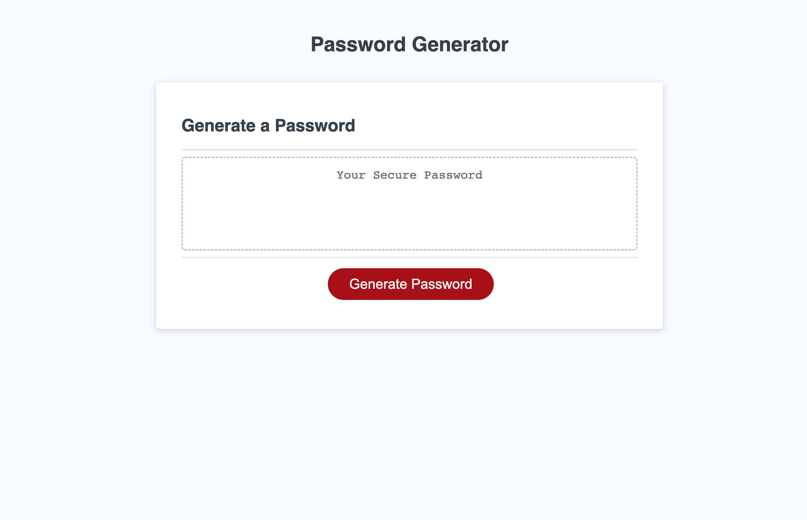

# JS-PWD-GEN

this website generates random passwords for users.

# CHALLENGE: 
In this challenge I had to incorperate javascript to fufill user experience/criteria. 
By doing so the user is able to click a Generate Password button to populate a total randomized password.

# LANGUAGES:
- JavaScript
- HTML
- CSS

# LINKS:
* https://jovanigomez.github.io/JS-PWD-GEN/
* https://github.com/jovanigomez/JS-PWD-GEN

# SCREENSHOT:

